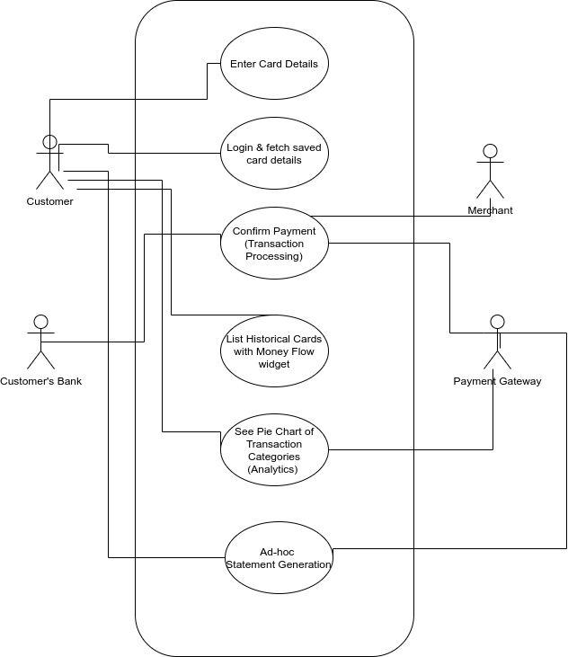

# Programming Methodology For Finance Project for  Fall 2021

**Project Name:**  B2C BANKING APPLICATION

**Team No: 02**

**Team Members:**
1. Aditi Satish <fa402@scarletmail.rutgers.edu>
3. Khyati Dinesh Patel <kp935@scarletmail.rutgers.edu>
4. Prachi Phatale <pp811@scarletmail.rutgers.edu>
5. Sudarshan Srinivasan <ss3020@scarletmail.rutgers.edu>

# Proposal

## Objective 
A project in the evolution of payment gateway from B2B business to B2C model. Creating a customer-centric banking application, which is exposed and marketed to the user. This application will offer REST-based APIs for integration with clients.

## Resources Listing - ( All are Collection of records - PERSISTENT)

1. Customer Information - The end customer's information. This will uniquely identify a customer which is doing the transaction.
   1. customer_uuid - This will act as a unique identifier for a end customer.
   2. Name of Customer
   3. Email
   4. Password
   5. Phone Number

2. Card Information - Saved card details will be fetched from here for a customer.
   1. Card Type
   2. Card Number
   3. Card Expiration Date
   4. customer_uuid

3. Transaction History
   1. Transaction type - CREDIT CARD/DEBIT CARD
   2. Transaction status - SUCCESS/FAILURE/IN_PROGRESS
   3. Transaction timestamp
   4. Merchant_uuid
   5. customer_uuid
   6. category_uuid

4. Live Transactions
   1. Transaction type
   2. Transaction status
   3. Transaction timestamp
   4. Transaction_amount
   5. Merchant id
   6. Customer id
   7. category_uuid

5. Statement
   1. Generated Timestamp
   2. Requested by
   3. Requested timestamp
   4. Status
   5. Timestamp range of statement

6. Merchant - A merchant is one who is receiving payments.
   1. merchant_uuid -  This will act as a unique identifier for the merchant.
   2. Merchant Name - Name of the merchant. eg. Amazon/Jacob Furniture/Logitech/COVID Relief Fund
   3. Merchant Type - Recognizing type through nature of business of merchant. eg. INDIVIDUAL/SMALL BUSINESS/ENTERPRISE/NON-PROFIT
   4. merchant bank - Merchnat's bank name. eg. WellsFargo/BOA
   5. merchant bank account number 

7. Transaction Category
   1. category_uuid - Identify a transaction category uniquely.
   2. Category_name - Categorizing merchants for analytics and business needs. eg. RESTAURANT/GROCERY/ECOMMERCE

## Goal
Goal Number | Goal |Feature  | Scope of Feature | Order of Execution | Module| Resources Used |   
|----| ----------- | ----------- | -------- |----------| -----|-----|
1|Basic Functionality| Perform a transaction (Between user and the merchant) by specifying card details.| The user can initiate the fund transfer to the merchant by adding card details| 1|  Server-side/UI|2. Card Information, 3. Transaction History, 4. Live Transactions|
2| Ease of Access| Saving card information from the historical transactions| Asking the user to create an account, if the user wants to save card info. For future use. The information  user enters will be stored in the payment gateway’s database. By saving the card details, the user does not have to enter the card details for every transaction.|2|UI/Server/DB| 1. Customer Information 2. Card Information|
3|Trust and Transparency|Get a complete view of how money flows through the transaction between the user and the merchant.|Money Flow is a UI widget getting populated with existing metadata stored in the database. The flow cannot be just within the server as we would contact the customer’s bank, intermediary bank, merchant’s bank. It will show a lineage in a widget containing transaction amount, customer's bank, intermediary bank, merchant bank. |3|UI / DB/ Server(very minimal)| 1. Customer Information, 2. Card Information, 6. Merchant
4|Real Time Analytics|Show a pie chart grouped on the transaction type.|Categorize/tag transactions into categories like grocery, e-commerce, restaurants to help users understand their spending.|3|UI / DB/ Server(very minimal)| 1. Customer Information, 7. Transaction Category, 3. Transaction History|
5|Ease of Access|Statement Download|Users should have options to download statements in pdf format requested on demand. We’ll take range as input from the user with maximum range upto 7 days.|3|Server/DB| 3. Transaction History, 5. Statement, 1. Customer Information|

## Actions Listing and Resource Mapping
|Actions | Resource Number | 
|-------|------|
| 1. User Authentication - READ & WRITE - #TODO Ask prof for auth libraries| 1 
| 2. Save Card Details (if new card) - CREATE| 2|
| 3. Transaction Initiation - CREATE| 4|
| 4. Transaction Confirmation - UPDATE| 4|
| 5. List Historical Transactions - READ| 3|
|6. Ad-hoc Statement Request Generation |3
|   6.1. Create a statmement request - CREATE|3
   6.2. Retrieve transaction history as per requested date filter - READ|3
   6.3. Generate a pdf statement - CREATE|3
   6.4. Email the pdf statement to customer - CREATE | 3 
|7. Retrieve saved card details - READ|2|
|8. Get Details for Money flow widget - READ|3,6|
|9. Get Details of Pie-chart analytics widget data - READ|3,6,7|

# Professor's Comments:
1. Your "Target Clients" also include selling products online, but none of the resources mention sales or products...? 
> We are a pure payment gateway product. We don't store any details about business/organization data.  

2. None of your resources mentions donations as a resource or an attribute of a resource.
    Should these be somehow accounted for in your resource list?
    Please clarify.
> Accounted in Resources Listing

3. You are mentioning categories of transactions, like grocery, e-commerce, restaurants, ...
    I'm not sure if there should not be a separate resource with a list of categories of transactions...?
    After all, the categories may need to be changed over time?!? 
> Agreed. We have normalized the transaction into a separate resource, and mapped it to history and live transactions with category_uuid.

4. You are using the term "Money Flow", but it is not listed as a resource.
   What is it? -- Please clarify.
> Money is a UI Feature. It's a widget which will show customer's bank, merchant's bank, any intermediaries.
> This is only to show transparency of a transaction.
> Money flow diagram is shown as follow: [image](https://user-images.githubusercontent.com/78879280/136880962-605282e9-6c17-46a8-8ab1-6cea62f7fb05.png)

5. I cannot see how this statement is reflected in your resource list.
   If something will be "stored in the database", then it must be explicitly shown in the list of resources.
> We have store statement information in point 5 of resources. The statement would be generated through Transaction History. 

6. I guess what you are trying to say is that your server will NOT store the information about transactions in a local database, but will create the transactions list dynamically, on demand, and destroy this information after it is presented to the client...?
   Is this true?
   If yes, make it explicit.
> No. We are going to persist transaction history, live transactions, customer's information in the database.
> Nothing will be destroyed as we may need data in future for auditing, compliance, analytics etc.

7. You left the list of Actions empty, but placed it before Resources.
   Because the Actions are on Resources, Actions should be listed after the Resources.
> There exist a diagram which show all the actions in the system. We commit the diagram in svg, to have vector image.
> We'll move it to a png based, to get better compatibility in browser.

8. Also make clear whether the results of these operations will be stored in your database.
> We'll not be storing pie-chart data, or any generated statement, because these are always re-creatable from existing table.

9. You already kind of indicated that the money flow will not be stored, but I'm not sure if this is what you wanted to say.
> Money flow is just a UI feature, which will be using data from transaction history, merchant. 

10. Although the use case diagram is important and please keep it in your report, this is NOT what I'm looking for.
    What I would like to see as "Actions" is what actions will your server receive in the request messages from your client.
    The server will execute these actions on the database resources
> Made a list of actions

### Review 3 - Oct 12, 2021 
10. In response to my request for "Actions", you have shown a use case diagram.
This diagram shows what tasks the user will perform using your system.
By the way, it is difficult for me to establish the correspondence between your table of "Goals" and your use case diagram. For example, I cannot figure out which use cases will display "Money Flow" or "Analytics/Pie Chart" ...?!? --- Please help me and make these relationships explicit.
> Added more details in use-case diagram and is in sync with Goals

11. For example, in the use case "Enter Card Details", the user will provide his or her card information.
The client will then send a request message to the server to "Create a new record in the "Card Information" collection.
This will probably be communicated as an HTTP POST message.
> Included in actions (point 2.)
 
12.Similarly, in the use case "List Historical Cards", the user will fill out some input fields that the client will submit to the server as an HTTP GET message, to perform an SQL SELECT query on the database and send the result back to the client.
Both of the above examples are single CRUD operations (create/update/read/delete).
> Updated CRUD operation type in actions.
 
13. On the other hand, your use case "Statement" is not a simple CRUD action, because the server needs to perform several operations to construct a statement and render it for display at the client. In addition, I see that you also have a "Statement" collection as a resource in your database, so the past generated statements will be stored for record.
    I would like to know the whole sequence of steps that the server will need to do during a statement construction.
> Sequence of steps added in actions, sub point of statement generation request

14. Similarly, a client's request to show "Money Flow" requires the server to perform a lot of steps, instead of a single CRUD operation.
    As you indicated in your Goals table, the server would contact the customer's bank, intermediary bank, etc.
    Then it would visualize a lineage in a widget containing transactions ... etc.
    Again, the server's work is not a single CRUD, but rather requires a sequence of steps.
    Please show these steps explicitly.
> Money flow widget is just a UI feature which makes shows information from historical trasaction. It doesn't contact the customer's bank, intermediary bank etc.
> The contact to customer's bank, intermediary bank, merchan't bank is done when we are actually doing a payment transaction. 
> These are listed as Transaction Initiation, Transaction confirmation in the actions now.
> MoneyFlow is just a single SELECT query which is getting information from multiple tables for a particular transaction.

15. As well, when a client requests to show "Analytics/Pie Chart", the server will again need to perform a lot of steps to construct a pie chart and then send it back in a response message.
> The server doesn't know about the pie chart or widgets. It's all in the UI (client end). The client will request data for the pie-chart and server will return the data.
> The pie-chart will be at a user-level, so server will technically run a SELECT query for that user with some group by on categories, historical transaction etc. 

16. I'm not sure how you're planning to implement user authentication, but I suspect it may not be READ-only and instead may need to store at the server side (WRITE) some token about the authenticated user...?
Please clarify.
> Ask prof. for Auth, can we use libraries? Can you give a example for auth code. 

17. in your item #5, List Historical Transactions - READ
    ...but I thought you will keep record of who and when requested a list of transactions ...?
    So, shouldn't this also include some server-side writing?
> List Historical is a GET call in the system. It's a READ-only API which returns list of transactions for the customer.
> We are not planning to keep a record for who and when requested this API. This is usually a part of audit and is not in scope
> of the project. 

18.
in your Actions Listing", please show which specific resources will be acted on by each of your actions.
> Done in actions list

19. Your proposal mentions contacting the customer's bank, intermediary bank, etc.
     Question: How will you simulate the bank APIs?
> We'll figure out a tool which can mock bank api. Postman should be able to do that. 
> If we didn't find such tool, we'll create a project giving us a dummy server with fixed static data.
> https://www.postman.com/features/mock-api/
> https://apiexplorer.openbankproject.com/?tags=#OBPv3_1_0-createAccount

### Use -case Diagram 

